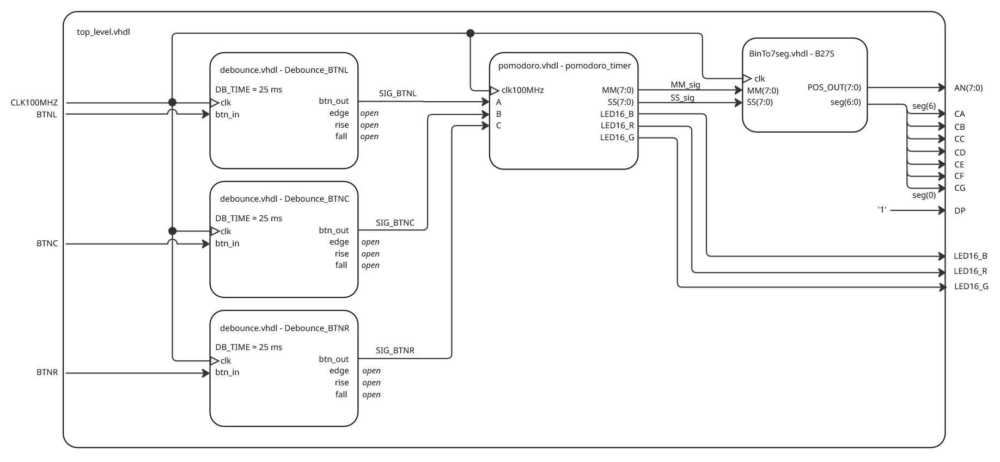

# DE1 Timer project

### Team members

* Vojtěch Šafařík (responsible for coding & poster creation)
* Hana Štěrbová (responsible for coding & diagrams)
* Martin Zatloukal (responsible for simulations & code formatting)
* Jan Žemlička (responsible for managing GitHub repository & video presentation)

### Abstract
This project focuses on creating a simple [pomodoro timer](https://pomofocus.io/) with Nexys A7-50T FPGA board. Pomodoro technique is a time management method that breaks your work into intervals (usually 25 minutes long), followed by short breaks (5 minutes long). After 4 working intervals a longer break follows (15 minutes). This technique is used to improve focus & productivity by balancing working intervals with regular rest times.

[**Video demonstration of our project**](https://youtu.be/NcyMTQrKaDQ)

## Hardware description of demo application

When launching the device, the user finds themselves in idle mode, indicated by LED16 emmiting blue colour. Upon pressing BTNC, the first working interval starts (LED16 emits red). If the user wishes to pause the current timer interval, they can do so by pressing BTNC again - LED16 turns off. When the working interval ends (or user skips the interval by pressing BTNR)

## Software description

The VHDL code consists of several entities:

- [**Pomodoro**](Pomodoro-Project/Pomodoro-Project.srcs/sources_1/pomodoro.vhd) module
    - The pomodoro module controls the timer logic. Internally, it uses an counter to generate 1 Hz pulses (*in demo application we generate 20 Hz pulses for presentation purposes*) from a 100 MHz onboard oscillator, allowing second-based countdown. State transitions (work - idle - break) are controlled by a FSM, which responds to debounced button inputs to start, pause, reset, or switch phases. The module tracks session progress via a *work_counter*, switching between short (5 min) and long (15 min) breaks after every fourth work session. Outputs include current time in BCD format (*MM, SS*) and RGB LED16 indicates the current state (work, break, idle, timer stopped).

- [**BinTo7seg**](Pomodoro-Project/Pomodoro-Project.srcs/sources_1/7seg.vhd) module
    - The BinTo7seg module converts two binary inputs (representing minutes and seconds) into digits displayed on a 4-digit 7-segment display using multiplexing. It includes a 250 µs clock divider that generates enable pulses for a 3-bit position counter, which sequentially selects which digit to display. At each active position, the appropriate decimal digit is extracted from the MM or SS variable, and then mapped to a 7-segment encoding. The full 4-digit multiplexing cycle completes every 1 ms.

- [**Debounce**](Pomodoro-Project/Pomodoro-Project.srcs/sources_1/debounce.vhd) module
    - The debounce component used here is originally from [DE1 VHDL course](https://raw.githubusercontent.com/tomas-fryza/vhdl-labs/refs/heads/master/examples/_debounce/debounce.vhd). It filters noisy mechanical button inputs using a 2-bit synchronizer and a time counter (25 ms). The logic checks for consistent high/low values across that duration before updating the internal debounced signal. The module detects signal transitions using XOR logic between the synchronized input and the stable signal.

- [**Top level**](Pomodoro-Project/Pomodoro-Project.srcs/sources_1/top_level.vhd)
    - The top_level module instantiates the pomodoro, BinTo7seg, and debounce modules and connects them via internal signals. The push buttons are routed through debouncing logic before controlling the timer's FSM. The BinTo7seg converter handles 7-segment output and digit selection for displaying the current countdown. RGB LED outputs reflect the active timer phase.

### Top level diagram

### Component(s) simulations

**TBD MARTINE RIIGHT**

## References

- https://en.wikipedia.org/wiki/Pomodoro_Technique
- https://pomofocus.io/
- https://github.com/tomas-fryza/vhdl-labs
- https://miro.com/
- https://vhdl.lapinoo.net/
- https://chatgpt.com/