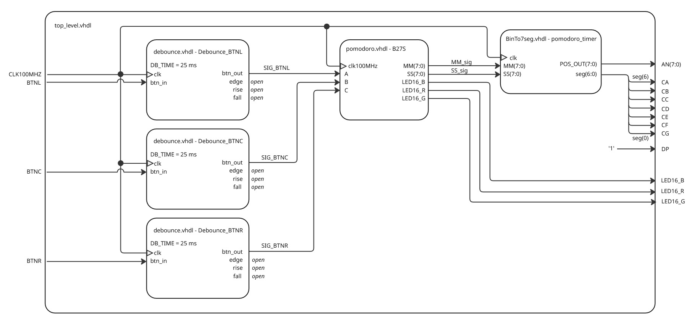

# DE1-project
### Team members

* Vojtěch Šafařík (responsible for coding, simulations & poster creation)
* Hana Štěrbová (responsible for coding & diagrams)
* Martin Zatloukal (responsible for simulations & code corrections + formatting)
* Jan Žemlička (responsible for managing GitHub repository & video description)

### Abstract
This project focuses on creating a simple [pomodoro timer](https://pomofocus.io/) with FPGA board. Pomodoro technique is a time management method that breaks your work into intervals (usually 25 minutes long), followed by short breaks (5 minutes long). After 4 working intervals a longer break follows (15 minutes). This technique is used to improve focus & productivity by balancing working intervals with regular rest times.

Our project aims to implement this simple timer onto Nexys A7-50T board.

[Photo(s) of your application with labels of individual parts.]

[Link to A3 project poster.]

[Optional link to video presentatioin.]

## Hardware description of demo application

Describe your implementation. Put a descriptive top-level schematic of your application.

## Software description

Put flowchats/state diagrams of your algorithm(s) and direct links to source/testbench files in `src` and `sim` folders.

### Component(s) simulations

Write descriptive text and put simulation screenshots of components you created during the project.

## References

1. Put here the references and online tools you used.
2. ...