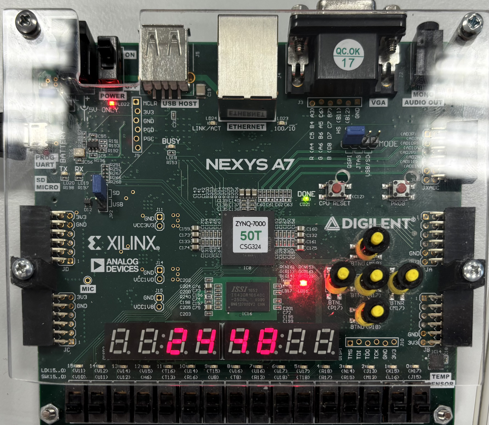
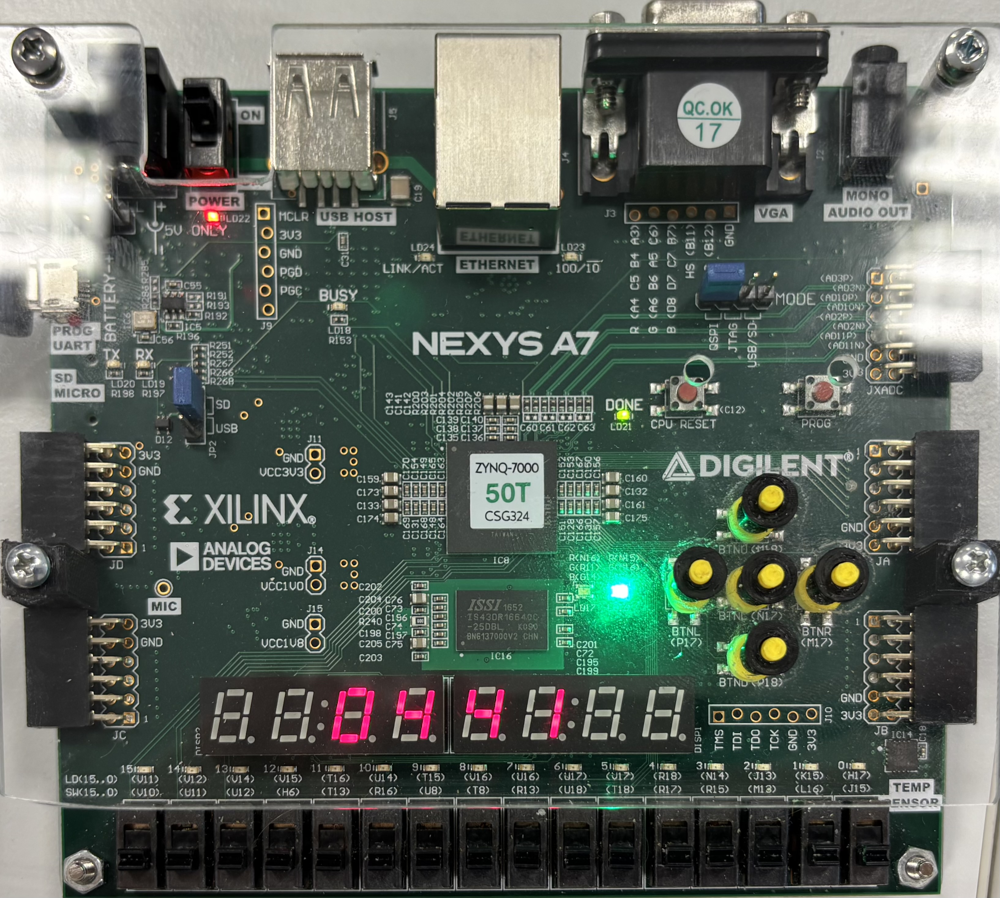
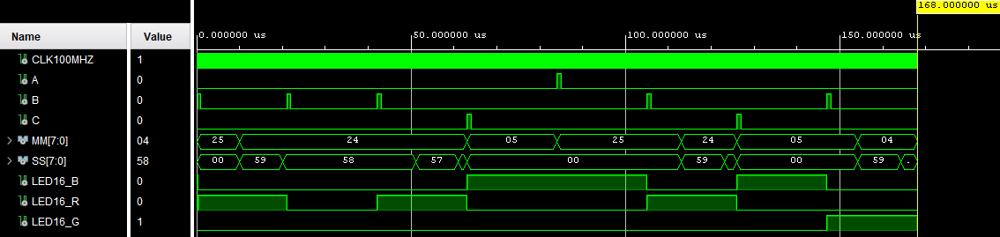

# DE1 Timer project

### Team members

* Vojtěch Šafařík (responsible for coding & poster creation)
* Hana Štěrbová (responsible for coding & diagrams)
* Martin Zatloukal (responsible for simulations & code formatting)
* Jan Žemlička (responsible for managing GitHub repository & video presentation)

### Abstract
This project focuses on creating a simple [pomodoro timer](https://pomofocus.io/) with Nexys A7-50T FPGA board. Pomodoro technique is a time management method that breaks your work into intervals (usually 25 minutes long), followed by short breaks (5 minutes long). After 4 working intervals a longer break follows (15 minutes). This technique is used to improve focus & productivity by balancing working intervals with regular rest times.

[**Video demonstration of our project**](https://youtu.be/NcyMTQrKaDQ)

## Hardware description of demo application

The user controls the timer using three buttons and can recognize the current mode by observing LED16, which changes color for each mode. Upon powering on the device, the user starts in **idle mode**, indicated by LED16 emitting a **blue** light and the 7-segment displays showing the next interval (25 minutes). Pressing **BTNC** starts the first **work interval** (LED16 turns **red**). If the user wishes to pause or resume the current interval, they can press BTNC again — the LED turns off during pause. When an interval ends, the timer awaits user input to proceed. Pressing BTNC again starts the next mode, in this case, a short break, indicated by the LED turning green. The user may **skip the current phase** and enter idle mode immediately by pressing **BTNR**, regardless of whether the current interval has finished.Additionally, the user can also **reset the timer** to its default state — the work interval count is reset to 0, and the next interval becomes a 25-minute work session — by pressing **BTNL**.

> Running work interval, indicated by red colour.

> Paused timer, LED16 is turned off.

> Timer is in idle state, indicated by blue colour. 7-segment displays are previewing the time of the next interval.

> Running break interval, indicated by green colour. 

## Software description

The VHDL code consists of several entities:

- [**Pomodoro**](Pomodoro-Project/Pomodoro-Project.srcs/sources_1/pomodoro.vhd) module
    - The pomodoro module controls the timer logic. Internally, it uses an counter to generate 1 Hz pulses (*in demo application we generate 20 Hz pulses for presentation purposes*) from a 100 MHz onboard oscillator, allowing second-based countdown. State transitions (work - idle - break) are controlled by a FSM, which responds to debounced button inputs to start, pause, reset, or switch phases. The module tracks session progress via a *work_counter*, switching between short (5 min) and long (15 min) breaks after every fourth work session. Outputs include current time in BCD format (*MM, SS*) and RGB LED16 indicates the current state (work, break, idle, timer stopped).

- [**BinTo7seg**](Pomodoro-Project/Pomodoro-Project.srcs/sources_1/7seg.vhd) module
    - The BinTo7seg module converts two binary inputs (representing minutes and seconds) into digits displayed on a 4-digit 7-segment display using multiplexing. It includes a 250 µs clock divider that generates enable pulses for a 3-bit position counter, which sequentially selects which digit to display. At each active position, the appropriate decimal digit is extracted from the MM or SS variable, and then mapped to a 7-segment encoding. The full 4-digit multiplexing cycle completes every 1 ms.

- [**Debounce**](Pomodoro-Project/Pomodoro-Project.srcs/sources_1/debounce.vhd) module
    - The debounce component used here is originally from [DE1 VHDL course](https://raw.githubusercontent.com/tomas-fryza/vhdl-labs/refs/heads/master/examples/_debounce/debounce.vhd). It filters noisy mechanical button inputs using a 2-bit synchronizer and a time counter (25 ms). The logic checks for consistent high/low values across that duration before updating the internal debounced signal. The module detects signal transitions using XOR logic between the synchronized input and the stable signal.

- [**Top level**](Pomodoro-Project/Pomodoro-Project.srcs/sources_1/top_level.vhd)
    - The top_level module instantiates the pomodoro, BinTo7seg, and debounce modules and connects them via internal signals. The push buttons are routed through debouncing logic before controlling the timer's FSM. The BinTo7seg converter handles 7-segment output and digit selection for displaying the current countdown. RGB LED outputs reflect the active timer phase.

### Top level diagram

### Components simulations

*Note: testbenches were created in an edited version of project for simulation purposes (changed clk times for shorter simulations, etc.)*

Simulated waveforms of pomodoro module using [tb_pomodoro](Pomodoro-Project-tb/Pomodoro-Project-tb.srcs/sim_1/new/TB_pomodoro.vhd) testbench.

> Here we can see how the timer (and LED) reacts to reset (A), start/pause/resume (B) and skip inputs (C). Applying short pulse to B input starts the timer, as a result, timer is subtracting (descending values of MM and SS) and LED16_R is active. By applying the pulse again to B input we can see how the timer stops (LED16 is off) or resumes. Applying pulse to C skips to the idle phase before next interval (MM & SS value change to preview next interval & LED16_B is active). Applying pulse to A resets the whole timer to default state.

Simulated waveforms of BinTo7seg module using [tb_7seg](Pomodoro-Project-tb/Pomodoro-Project-tb.srcs/sim_1/new/TB_7seg.vhd) testbench.

> In this simulation we can observe how the display multiplexing logic reacts to changes of binary inputs for MM and SS. For purposes of this testbench they were set to 01:02 and later on to 03:04 (in decimal). As the digit position counter cycles through values (visible as active-low bits in POS_OUT), we observe corresponding digit selection and segment output. When the rightmost digit (POS_OUT = 11111011) is active, SS units (2) are displayed — seg = 0010010. As POS_OUT moves left, the next digits are shown: SS tens (0 -> seg = 00000001), MM units (1 -> seg = 1001111), and MM tens (0). The same cycle follows for next phase (03:04).

Simulated waveforms of Top level module using [tb_top](Pomodoro-Project-tb/Pomodoro-Project-tb.srcs/sim_1/new/TB_top_level.vhd) testbench.

> In the picture above, we can see the LED and the individual cathodes of the 7-segment display reacting to the button inputs. The default idle mode (indicated by LED16_B) is switched upon pressing the center button to a work mode indicated by a LED16_R, which also starts the countdown, indicated by the individual cathodes. The following presses of the center button pause and resume the countdown (pause is indicated by no active LED), after which the right button, BTNR, skips the work mode into the following idle mode, after which a short break follows. The short break is also launched by BTNC. The BTNL restarts the top_level into the default idle mode again. At the bottom, we can see active AN[5:2], which stands for the 4 active center displays of the FPGA used for the project implementation. 

*Debounce module is unchanged from the one used in DE1 labs.*

## Possible improvements

- Custom time interval mode using switches to set time values
- An audio cue when an interval ends

## References

- https://en.wikipedia.org/wiki/Pomodoro_Technique
- https://pomofocus.io/
- https://github.com/tomas-fryza/vhdl-labs
- https://miro.com/
- https://vhdl.lapinoo.net/
- https://chatgpt.com/